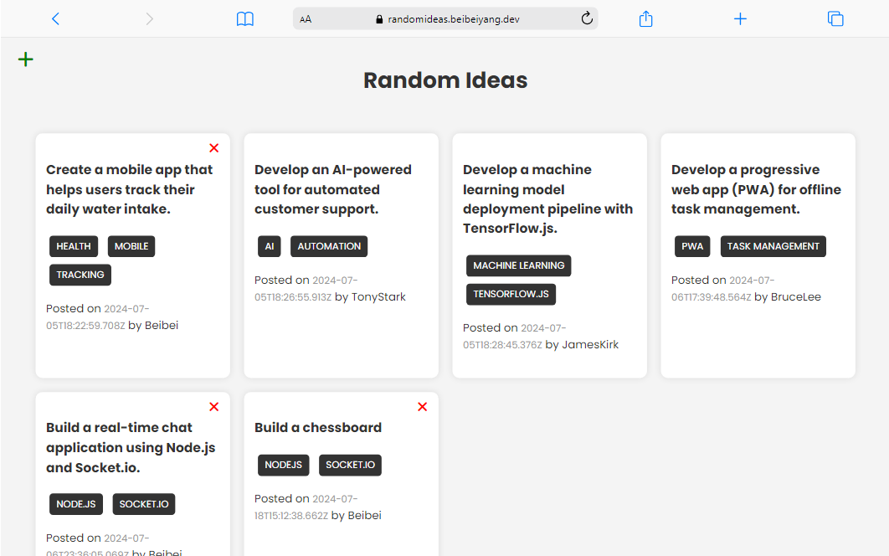

# Rand Ideas

## Overview
This application allow users to add and delete ideas, and add tags. A user can only delete his own idea. The app is built with NodeJS, Express and MongoDB.

## Built With
- NodeJS
- Express
- MongoDB
- Webpack

## Live Demo

Check out the live deo [Random Ideas Kanban](https://randomideas.beibeiyang.dev/).

## Features
- Persistent data to MongoDB through Mongoose
- Built NodeJS server with MVC pattern
- Uses Axios to handle REST request.
- Uses localStorage to store username

## License
The code is licensed under [Apache 2.0](https://www.apache.org/licenses/LICENSE-2.0.txt).

## Contact
- Beibei Yang [beibeiyang88@hotmail.com](mailto:beibeiyang88@hotmail.com)
